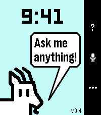

# Billy

Billy is a Gemini assistant for Pebble watches, forked from Bobby. Ask a
question or give a task by voice; Billy answers on the watch with short text
and Pebble-style cards (weather, timers, numbers, maps, pictures) and can act
on your phone and Google account.

No server is involved: requests go from your phone to Google with your own
Gemini API key.



## Watches

Pebble Time 2 (emery), Pebble Round 2 (gabbro), Pebble Time / Time Steel
(basalt), Pebble Time Round (chalk), Pebble 2 (diorite), Pebble 2 Duo (flint).
The original Pebble (aplite) has too little memory.

## Two ways to run

- **Watch app only** (iPhone or Android): install the PBW and paste a Gemini
  API key in its settings. Includes alarms, timers, timeline reminders,
  weather, maps, pictures, web search, a read-only calendar from iCal links,
  and memory.
- **With Billy Companion** (Android): adds Google Calendar, Tasks, Gmail,
  Drive/Docs, contacts, texts and calls, notifications and music, your phone's
  photos, navigation, and opening apps. Sending, calling and deleting always
  ask for confirmation on the watch.

## Setup

1. Get a Gemini API key at https://aistudio.google.com/app/apikey (you pay
   Google for your own usage).
2. Watch app: open Billy's settings in the Pebble app and paste the key.
3. Companion (optional): install the APK, open Billy Companion and follow its
   four steps: Gemini key, Connect Google, phone access, memory.
4. Optional, experimental: in Billy Companion, sign in to your own Gemini
   account (card 5). Billy can then use what only the Gemini app knows: your
   whole Google Photos library, Gemini's saved info and past chats, Gems,
   Keep, YouTube and Google Home. If it stops working, Billy falls back to its
   normal tools. The sign-in stays on the phone.

Personal context can also be imported as a Profile Pack; see
`docs/BILLY_PROFILE_PACK_TEMPLATE.md`.

## Building

GitHub Actions builds everything on each push (`.github/workflows/build-pbw.yaml`)
and publishes `Billy-dev.pbw` and `BillyCompanion-dev.apk` to the
`dev-<branch>` prerelease. Locally:

```powershell
cd app; pebble build                                  # app/build/app.pbw
cd companion-android; .\gradlew.bat assembleDebug     # app/build/outputs/apk/debug/
```

Tests: `node tools/pkjs-tests/agent.test.js`, `node tools/pkjs-tests/delivery.test.js`,
and `.\gradlew.bat testDebugUnitTest` in `companion-android`.

Store screenshots come from the emulator with scripted answers
(`.github/workflows/screenshots.yaml`); the results are in `store/screenshots/`.

### Google setup (developer)

Google sign-in identifies Billy Companion by package
`com.tombo.billyassistant.companion` and signing SHA-1
`1B:98:A8:38:72:6D:27:12:AA:25:3B:2B:AE:AF:BB:B3:8D:2F:16:1B`. Enable the
Calendar, Tasks, Gmail, Drive, People, Docs, Sheets, Slides and Forms APIs in
the project that owns the Android OAuth client. A Play Store release needs its own SHA-1 added there.

## Credits

Forked from Bobby / Tiny Assistant by the Rebble and Pebble community.
Developer: Thomas Bolger. Artwork: Sarah Bolger and Katherine Berry.
The dog photo in the store screenshots is a public-domain US Forest Service
photo (see `store/screenshots/CREDITS.txt`).

Apache 2.0; see `LICENSE`. Billy is not an official Google, Pebble, Core
Devices or Rebble product.
